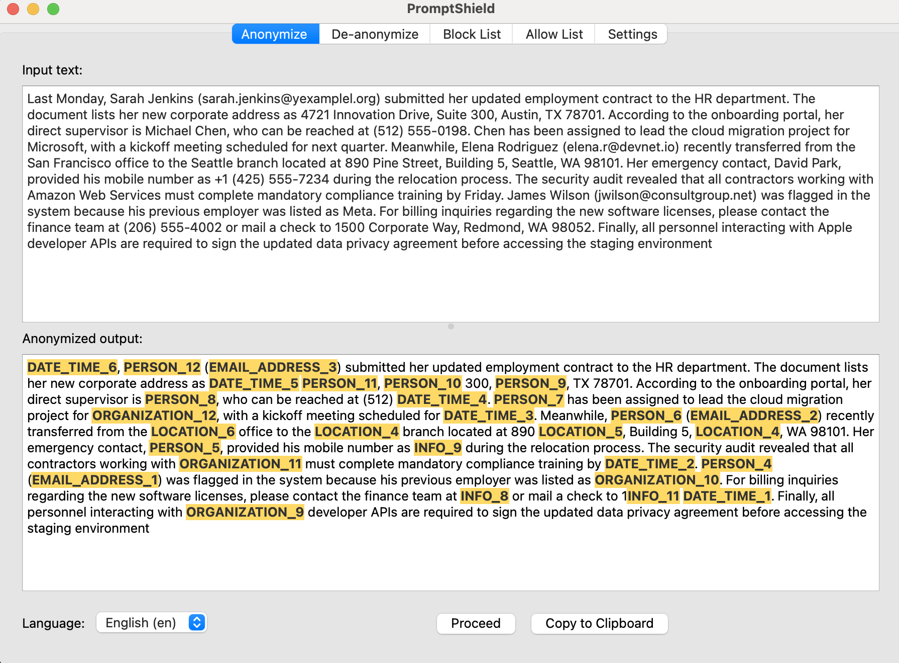
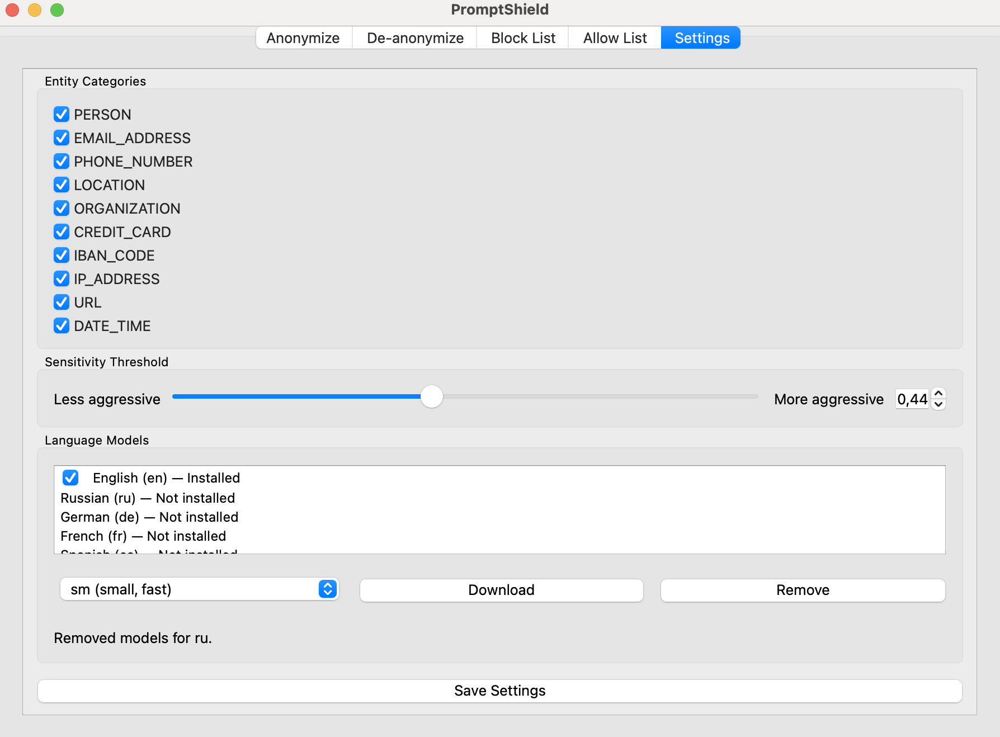

# PromptShield

A desktop application for anonymizing personal data before sending text to cloud-based LLMs. It replaces sensitive entities (names, emails, addresses, phone numbers, etc.) with labeled placeholders like `PERSON_1`, `EMAIL_ADDRESS_3`, `LOCATION_7` and maintains a persistent mapping so that LLM responses can be de-anonymized back.

Fully offline after initial language model download. No data leaves your machine.

## Screenshots

### Anonymization



### Settings



## Features

- **Anonymize** — paste text, select language, click Proceed. All detected PII is replaced with consistent placeholders.
- **De-anonymize** — paste an LLM response containing placeholders, get the original text back.
- **Block List / Allow List** — force-mask or protect specific words and phrases, with prefix matching and case sensitivity options.
- **Multi-language** — download spaCy models for English, German, Chinese etc.
- **Configurable** — choose which entity categories to detect, adjust sensitivity threshold.
- **Interactive output** — hover over a placeholder to see the original value; right-click to mask/unmask, block, or allow.

## Tech Stack

| Layer | Technology |
|---|---|
| UI | PySide6 (Qt 6) |
| NER | Microsoft Presidio (Analyzer + Anonymizer) |
| NLP | spaCy |
| Persistence | SQLite |
| Packaging | PyInstaller |

## Development Setup

```bash
# Clone
git clone https://github.com/strngrq/prompt_shield.git
cd prompt_shield

# Create virtual environment
python3 -m venv venv
source venv/bin/activate        # macOS / Linux
# venv\Scripts\activate         # Windows

# Install dependencies
pip install -r requirements.txt

# Download at least one spaCy model
python -m spacy download en_core_web_sm

# Run
python -m prompt_shield.app
```

## Building a Standalone Bundle

The build script creates a self-contained application using PyInstaller:

```bash
# 
./scripts/build.sh
```

This will:

1. Set up a venv and install all dependencies (if not already present).
2. Download the `en_core_web_sm` model (bundled with the app).
3. Run PyInstaller with `prompt_shield.spec`.
4. Output the app to `dist/`.

After the build:

```bash
# macOS
open dist/PromptShield.app
# or
./dist/PromptShield/PromptShield

# Windows — run the generated .exe
dist\PromptShield\PromptShield.exe
```

Additional language models can be downloaded from **Settings → Language Models** inside the running application.


## License

MIT
